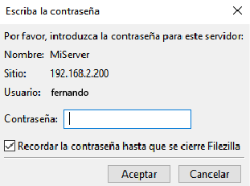

## Autor
Fernando Bueno Rivera

# preguntas

#### ¿Qué pasa si no hago el link simbólico entre sites-available y sites-enabled de mi sitio web?
En NGINX, sites-available alberga todas las configuraciones posibles de los sitios web que puedes tener en tu servidor. sites-enabled, por otro lado, contiene los enlaces simbólicos que activan esas configuraciones.

Si omites crear el enlace simbólico desde sites-available hacia sites-enabled, NGINX no leerá ni aplicará la configuración de tu sitio web. Esto resultará en que tu sitio web no se cargue y, en su lugar, los visitantes verán la página por defecto del servidor NGINX (default).

#### ¿Qué pasa si no le doy los permisos adecuados a /var/www/nombre_web?
Si no asignas los permisos adecuados a la carpeta /var/www/nombre_web, podemos enfrentarnos a varios problemas que afectarán el funcionamiento de tu sitio web.


## La estructura 

La estructura del proyecto es la siguiente:

```scss
.
├── Vagrantfile
└── sh/
     │
     ├── nginx.sh
     ├── ftp.sh
     ├──primeraPagina(git).sh
     └──segundaPagina(ftpd).sh
```

### Funcionamiento de la WEB

Primer sitio web, con GIT.


Segunndo sitio web, con FTP.


### Transferencia con FTP

Conexión:


Contraseña:




---
### Redireccion de nombres
En el archivo local de ordeandor dentro de `C:\Windows\System32\drivers\etc\hosts`

```scss
192.168.2.200 server.test
192.168.2.200 fernando.test
```